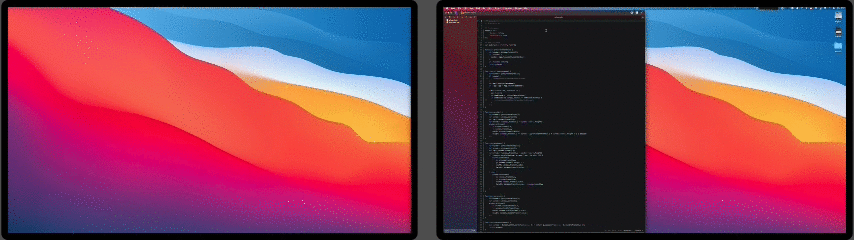

# phoenix-config
Glen de Vries's Phoenix Configuration

## I ❤️ Phoenix

[Phoenix](https://github.com/azamuddin/phoenix) is my macOS window manager of choice. My config is used with both single and multi-monitor setups.

Everything is uses the shortcut keys `ctrl-option`...

* `ctrl-option-return` maximizes window on current screen
* `ctrl-option-left` moves current window to the left half of screen, or to the screen to the left 
* `ctrl-option-right` moves current window to the right half of screen, or to the screen to the right 
* `ctrl-option-up` expands window vertically to top of screen, and if already at top, shrinks it to top half of screen
* `ctrl-option-down` expands window vertically to bottom of screen, and if already at bottom, shrinks it to bottom half

Several tweaks run automatically to deal with things like screens of different heights, with or without menubars and docks, and when windows can't be precisely resized (like Terminal).

## Installation

Once Phoenix is installed, copy the `phoenix.js` file in the repo to `~/.phoenix.js`. If you use `wget` (e.g. via [Homebrew](https://brew.sh))... 

	wget -O ~/.phoenix.js https://github.com/gdev/phoenix
	
## Thats it

You can follow me on social [@CaptainClinical](https://twitter.com/CaptainClinical)